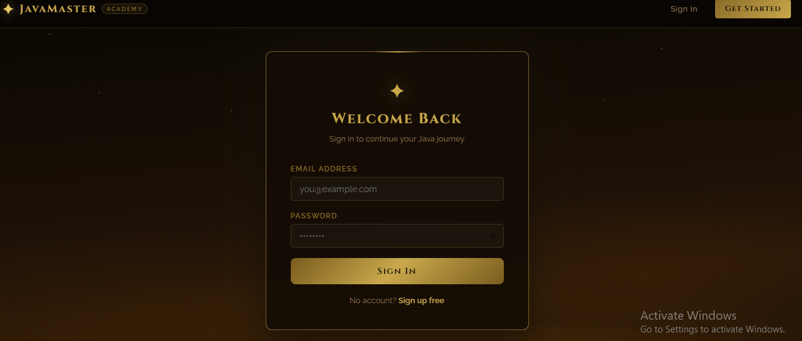
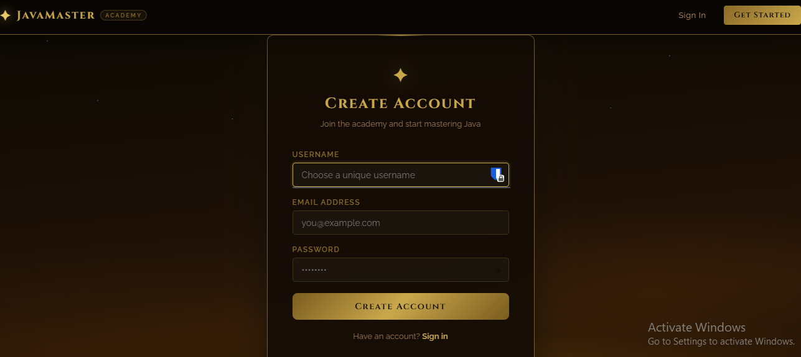
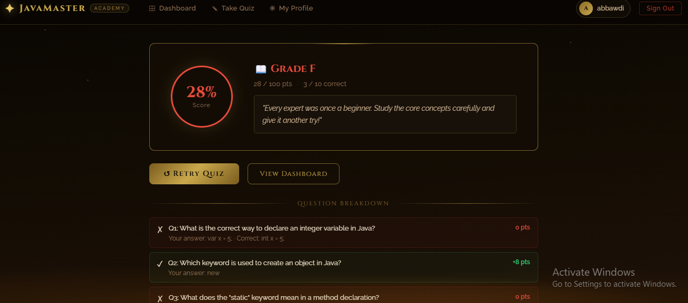
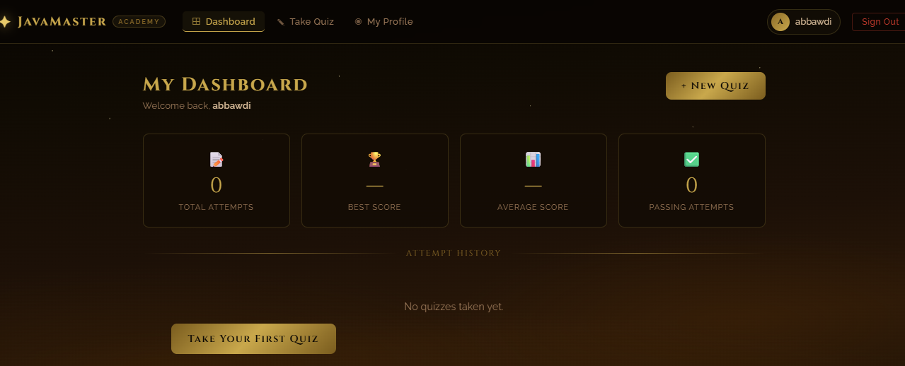
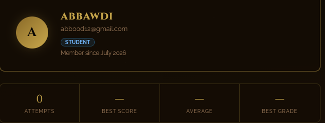
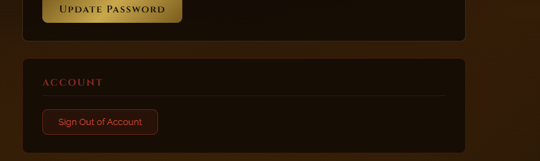

# JavaMaster Academy

A full-stack Java quiz app — users sign up, take a scored Java knowledge quiz, and track their progress over time.

> Runs locally via XAMPP (not hosted / no live demo).

## Screenshots






 # 2 photos 
  # 2 ways,visible in photos


## Features

- User signup/login with JWT authentication and hashed passwords
- 10-question Java quiz with weighted scoring and letter grades
- Results history — best score, average score, pass count, last 5 attempts
- Responsive React UI with dashboard, quiz, and profile views

## Tech Stack

**Frontend:** React
**Backend:** Node.js, Express
**Database:** MySQL
**Auth:** JSON Web Tokens (JWT), bcrypt

## Project Structure

```
SE_project/
├── frontend/     # React app
├── backend/      # Express API + MySQL
│   └── schema.sql
└── screenshots/
```

## Getting Started

### 1. Database
Import the schema into MySQL (e.g. via XAMPP/phpMyAdmin or CLI):
```
backend/schema.sql
```

### 2. Backend
```bash
cd backend
npm install
cp .env.example .env   # then fill in your own values
nodemon server.js
```

### 3. Frontend
```bash
cd frontend
npm install
npm start
```

The app will run at `http://localhost:3000`, with the API on `http://localhost:5000`.

## Environment Variables

See `backend/.env.example` for required variables (JWT secret, DB credentials).

## Notes

This project was built as a UI/frontend-focused exercise. The backend is a functional but lightweight demo API — not hardened for production use.